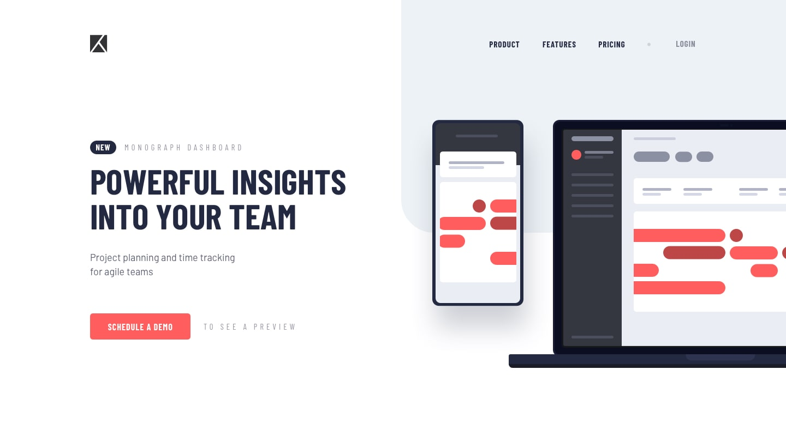
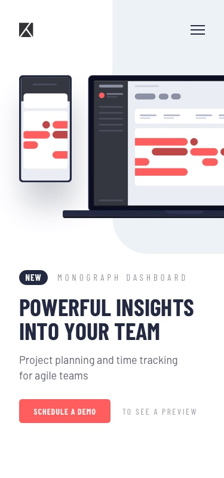

<div align="center">

# 📊 Project Tracking Intro Component

### Frontend Mentor Challenge Solution

## 🚀 [Ver Site ao Vivo →](https://anaclarissi.github.io/project-tracking-intro/)

<br>

[](https://github.com/anaClarissi/project-tracking-intro)
[](https://www.frontendmentor.io/challenges/project-tracking-intro-component-5d289097500fcb331a67d80e)
[](https://www.frontendmentor.io/profile/anaClarissi)

</div>

---

## 📸 Preview

### 🖥️ Desktop



### 📱 Mobile



> *Imagens de preview geradas a partir do design oficial do desafio.*

---

## 🎯 Sobre o Projeto

Este projeto é uma solução para o desafio **Project Tracking Intro Component** da plataforma [Frontend Mentor](https://www.frontendmentor.io). O objetivo foi reproduzir fielmente um componente de introdução para uma aplicação de rastreamento de projetos, com foco em layout responsivo, navegação acessível e fidelidade ao design proposto.

> ⚠️ **Este projeto não possui fins lucrativos.** Foi desenvolvido exclusivamente para fins de aprendizado e prática de habilidades em desenvolvimento front-end.

---

## 🔗 Links

| Recurso | URL |
|---|---|
| 🌐 Site ao vivo | [anaclarissi.github.io/project-tracking-intro](https://anaclarissi.github.io/project-tracking-intro/) |
| 📁 Repositório | [github.com/anaClarissi/project-tracking-intro](https://github.com/anaClarissi/project-tracking-intro) |
| 🎯 Desafio original | [Frontend Mentor – Project Tracking Intro](https://www.frontendmentor.io/challenges/project-tracking-intro-component-5d289097500fcb331a67d80e) |
| 👤 Meu perfil | [frontendmentor.io/profile/anaClarissi](https://www.frontendmentor.io/profile/anaClarissi) |

---

## 🛠️ Tecnologias Utilizadas

- **HTML5** — Estrutura semântica e acessível
- **CSS3** — Estilização personalizada com variáveis CSS (custom properties)
- **Bootstrap 5.3** — Grid responsivo e componente de navbar com menu hamburguer
- **Google Fonts** — Fontes *Barlow* e *Barlow Condensed*

---

## 📚 Aprendizados

Esse desafio foi uma ótima oportunidade para consolidar e aprofundar conhecimentos importantes:

### 🎨 CSS Avançado
- Uso de **variáveis CSS** (`--red-400`, `--blue-950`, etc.) para manter consistência visual e facilitar manutenção
- Posicionamento com `position: absolute` e `z-index` para criar o efeito de fundo recortado (`border-radius: 0 0 0 4rem`)
- Uso do seletor `:has()` para alterar o ícone do menu (hamburguer → fechar) de forma puramente declarativa em CSS

### 📐 Layout Responsivo
- Construção de layout mobile-first com múltiplos breakpoints (`960px`, `1024px`, `1280px`, `1920px`)
- Transição de layout de coluna única (mobile) para lado a lado com `flex-direction: row-reverse` (desktop)
- Fundo decorativo reposicionado e redimensionado entre breakpoints sem duplicar elementos HTML

### 🧩 Bootstrap na Prática
- Integração do **Navbar collapse** do Bootstrap com customizações visuais profundas via CSS próprio
- Override de estilos padrão do Bootstrap sem conflitos, respeitando a especificidade dos seletores
- Uso do `data-bs-toggle="collapse"` para o menu hamburguer responsivo

### ♿ Acessibilidade
- Uso de `aria-hidden="true"` em elementos puramente decorativos
- `aria-label` e `aria-expanded` no botão de toggle da navbar
- Alternância de ícone do menu acessível via CSS com `:has()` e `::before`

---

## 📁 Estrutura do Projeto

```
project-tracking-intro/
├── index.html
└── src/
    ├── css/
    │   └── style.css
    └── images/
        ├── favicon-32x32.png
        ├── logo.svg
        ├── illustration-devices.svg
        ├── icon-hamburger.svg
        └── icon-close.svg
```

---

## 🚀 Como Rodar Localmente

```bash
# Clone o repositório
git clone https://github.com/anaClarissi/project-tracking-intro.git

# Acesse a pasta
cd project-tracking-intro

# Abra o arquivo index.html no seu navegador
# Ou use a extensão Live Server no VS Code
```

---

<div align="center">

Desenvolvido com 💙 por **Ana Clarissi** como solução de desafio [Frontend Mentor](https://www.frontendmentor.io)

</div>